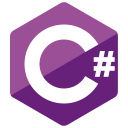
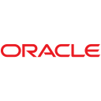

# 👋 Hi, I'm Mahmoud Abu Alsebaa

<p align="center">
  
</p>

<!-- Fonts : Silkscree | Orbitron |  Press+Start+2P -->
 
---

## 👤 About Me

I am a **Software Engineer** specializing in building **modern mobile applications** and **high-performance backend systems**. My work focuses on Flutter & Native Android for mobile, and ASP.NET Core for scalable, clean-architecture backends.

> [!NOTE]
> Focused on writing clean, maintainable code and building efficient architectures that solve real-world problems.

---
# 📚 Core Technologies

### Backend & Mobile
<p align="left">
   &nbsp;&nbsp;&nbsp;&nbsp;&nbsp;&nbsp;&nbsp;&nbsp;
   &nbsp;&nbsp;&nbsp;&nbsp;&nbsp;&nbsp;&nbsp;&nbsp;
   &nbsp;&nbsp;&nbsp;&nbsp;&nbsp;&nbsp;&nbsp;&nbsp;
   &nbsp;&nbsp;&nbsp;&nbsp;&nbsp;&nbsp;&nbsp;&nbsp;
  
</p>

### Languages
<p align="left">
   &nbsp;&nbsp;&nbsp;&nbsp;&nbsp;&nbsp;&nbsp;&nbsp;
   &nbsp;&nbsp;&nbsp;&nbsp;&nbsp;&nbsp;&nbsp;&nbsp;
   &nbsp;&nbsp;&nbsp;&nbsp;&nbsp;&nbsp;&nbsp;&nbsp;
   &nbsp;&nbsp;&nbsp;&nbsp;&nbsp;&nbsp;&nbsp;&nbsp;
   &nbsp;&nbsp;&nbsp;&nbsp;&nbsp;&nbsp;&nbsp;&nbsp;
  
</p>

### Databases
<p align="left">
   &nbsp;&nbsp;&nbsp;&nbsp;&nbsp;&nbsp;&nbsp;&nbsp;
   &nbsp;&nbsp;&nbsp;&nbsp;&nbsp;&nbsp;&nbsp;&nbsp;
   &nbsp;&nbsp;&nbsp;&nbsp;&nbsp;&nbsp;&nbsp;&nbsp;
   &nbsp;&nbsp;&nbsp;&nbsp;&nbsp;&nbsp;&nbsp;&nbsp;
  
</p>

### Tools
<p align="left">
   &nbsp;&nbsp;&nbsp;&nbsp;&nbsp;&nbsp;&nbsp;&nbsp;
   &nbsp;&nbsp;&nbsp;&nbsp;&nbsp;&nbsp;&nbsp;&nbsp;
  
</p>


---

# 🚀 Featured Projects

### 🛒 [Smart Agriculture System](https://github.com/mahmoudjawad02025/flutter_smart_agriculture_system.git)
Architecting a scalable agritech platform integrating AI-driven crop disease diagnostics with automated irrigation and fertilization logic, utilizing BLoC/Cubit for robust state management and Firebase for cloud synchronization.

### 📱 [Watch App](https://github.com/mahmoudjawad02025/flutter__watch_app)
Flutter Bloc — High-performance streaming app with adaptive layouts and YouTube API integration.

### 🎓 [Nibras Learning Platform](https://github.com/mahmoudjawad02025/asp_nibras_project.git)
ASP.NET Core 9 & SQL Server — A scalable 3-layer (DAL/BLL/PL) API using generic repository patterns and JWT security. Features include student progress tracking, hierarchical course/lesson management, and file upload services.


---

# 🐍 Contribution Graph

<p align="center">
  
</p>


---


# 📬 Contact

<p align="center">
  <a href="mailto:mahmoudjawad02025@gmail.com"></a>&nbsp;&nbsp;&nbsp;&nbsp;&nbsp;&nbsp;&nbsp;&nbsp;
  <a href="https://linkedin.com/in/mahmoud-abu-alsebaa"></a>&nbsp;&nbsp;&nbsp;&nbsp;&nbsp;&nbsp;&nbsp;&nbsp;
  <a href="https://github.com/mahmoudjawad02025/"></a>
</p>


<br>


<div>

```js

class Developer extends Human {
  goal = "Engineering the intersection of logic and empathy";
}

```

</div>

<br>

<p align="center">
  
</p>

<br>


